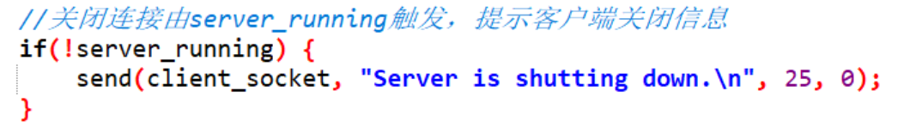

# 计算机网络实验：聊天室设计报告
### 2213739 杨涵
## 一、聊天协议

1. **用户名输入**：
   - 用户在进入聊天室前需在执行客户端文件的Linux终端输入用户名，按提示操作。
   - 用户名支持任意字符组合（除回车外），包括中文。
   - 用户名长度不能超过1024B（UTF-8编码方式中，一个中文占3B，一个普通字符占1B）。超过部分会被自动截断。
   - 输入回车以确认用户名。
   - 聊天室中接收到的消息将显示发送者的用户名，自己发送的消息前将加上“(You)”标识。

2. **消息发送**：
   - 用户名确认后，客户端文件会自动打开输入文本框，消息在文本框内输入，鼠标单击底部的"Enter message"按钮提交。
   - 聊天消息可以为任意字符组合，（单独的“quit”除外），支持中文、带回车的字符串。
   - 发送消息长度不能超过1024B（UTF-8编码方式中，一个中文占3B，一个普通字符占1B）。
   - 鼠标单击底部的"Enter message"按钮后发送消息，若输入缓冲区为空，发送操作无效。
   - 输入“quit”发送请求以退出聊天室，执行后客户端将关闭。如果手动关闭输入文本框，程序不能自动结束，需要用户手动关闭进程。

3. **消息接收**
   - 接收到的聊天消息在运行客户端的Linux终端显示。禁止在输入用户名后再在Linux终端输入信息，否则会破坏消息界面的正常显示。
   - 聊天消息的顺序按本地客户端接收到排列，通常与客户发送顺序、服务器接收顺序均保持一致。
   - 聊天室中接收到的消息将显示发送者的用户名，自己发送的消息前将加上“(You)”标识。
   - 聊天室中接收到的消息将附加时间戳，是发送者在确认发送时，发送者自己本地的时间。

4. **服务器状态**：
   - 服务器运行在"192.168.86.128"的IPV4地址、8080的端口上。
   - 聊天室中最多支持100人在线，超过之后拒绝连接。
   - 发送消息实际是客户端发送给服务器端，接收消息实际是接收的服务器端转发的消息。
   - 发送和接收消息需服务器保持开启状态；若服务器关闭，将提示连接失败并退出程序。
   

## 二、实现功能

1. **用户自定义用户名**：
   - 用户在进入聊天室时设定用户名，以便在消息中标识发送者。
  
2. **灵活的消息格式**：
   - 聊天程序允许发送除回车以外的任意字符组合的消息，增强聊天体验。
   - 用户接收到的消息有额外的消息来源标识，包括发送者用户名、时间戳。
3. **退出功能**：
   - 客户端可通过输入“quit”请求退出聊天室。
   - 服务器端同样可以输入“quit”来关闭聊天室，断开所有连接。

4. **客户端的输入与接收界面分离**：
   - 将客户端的输入与接收界面分离，使得输入缓冲区的消息能够缓存显示、不被接收消息覆盖，同时使得接收到的消息单独陈列、结构清晰。
   - 客户端通过新打开的文本框输入，接收到的消息在执行可执行文件的Linux终端界面输出。
   - 客户端的输入与接收消息相对独立，接收到消息后不会影响输入端已经创建、未回车发送的消息。

## 三、使用说明与效果展示
- 聊天室的使用需要服务器端在运行，用户想要接入聊天室运行客户端即可。
- 服务器端编译代码命令：gcc -o server server.c
- 客户端编译代码命令：gcc -o client client.c \`pkg-config --cflags --libs gtk+-3.0\` 
- 运行服务器端、客户端操作简单，只需要在Linux终端中直接执行可执行文件：./server，./client。
- 服务器运行地址随执行文件的设备IP地址而变化，变化之后需要在客户端代码文件中进行修改、指认新的IP地址。
- **服务器端**
以下为服务器端的运行界面，包括服务器端的启动、监听消息以及对服务器端`quit`命令的响应。

- **客户端**
以下为客户端的Linux终端运行界面，主要用于用户名输入、天信息的显示：

以下为gtk文本框界面，主要用于用户输入（包括quit命令的输入）：

下面展示客户端对客户自行发起的`quit`命令的响应。
- 准备quit:

- quit之后：能够正常退出。

## 四、实现方法
### 设计思路说明

- 本聊天室设计采用多线程架构，服务器端通过1+1+n个线程，分别负责输入命令处理、连接管理和客户消息处理。
- 使用互斥锁确保连接列表的安全访问，避免多线程带来的数据一致性问题。
- 客户端则采用简化的结构，采用1+1个线程，分别处理消息的发送与接收，确保用户体验的流畅性。

### 服务器端

#### 线程结构

- **命令线程**：
  - 创建一个专门的线程用于监测服务器端输入，检测到“quit”命令后开启关闭所有连接的逻辑。
  - “关闭所有连接”是形式上的，即设置`server_running=0`。真正的关闭连接发生在`shutdown`函数或客户线程中。具体逻辑在下面有专门的说明。
  
  - 服务器端接收到quit命令后，会发送给客户端一个"服务器端即将关闭"的消息，以促使客户端结束进程。
  
  正确性说明：这个消息看似是可以由其他用户伪造的，但由于经过广播的用户发送的消息都自带用户名和时间戳，伪造实际不可行。
- **连接管理线程**：
  - 该线程在主函数中，负责管理新用户的连接。如果没有客户端发起连接请求，该线程将一直阻塞在`accept`调用上：`accpet`函数默认采用阻塞式，即如果没有接收到连接请求会一直停留。
  
- **客户线程**：
  - 为每个连接的客户创建独立的线程，负责接收该客户发送的信息并进行广播，同时处理“quit”请求以断开连接。
  
  - 主要功能如下图所示，`arg*`为客户线程传入参数指定其负责的客户，线程负责用while循环监听该客户发送的消息。
  
- **客户线程-消息广播**：
  - 当接收到来自某个客户的消息时，广播该消息给在连接列表中的所有客户。这个过程利用了一个在连接列表，记录了当前与服务器建立连接的客户端ID。
  - 具体代码如下图所示，为了增加程序并行性（让多个客户线程同时进行消息广播），互斥锁只在复制客户端时添加，添加完毕后即解锁，从而实现各个客户线程能够并行地进行消息发送。互斥锁的作用在下面`在连接列表`中有说明。
  
#### 在连接列表

- **维护在连接列表**：
  - 在服务器端维护一个在连接列表，记录当前所有连接的客户。每当有新的客户连接或断开时，都需更新此列表。
  - 如下图所示，分别对应着连接线程中建立连接时对列表的添加、客户线程中断开连接时对列表的删除。对列表删除的逻辑是，数组中找到对应线程客户ID的元素后，将列表的最后一位直接挪到这一项来。
  
  
- **互斥锁**：
  - 在访问连接列表时，使用全局的互斥锁以保证线程安全，避免多个线程同时修改在连接列表导致数据不一致。
  
  - 一致性解释：请看上面的消息广播函数！注意到消息广播中利用临时数组记录了某一时刻的客户列表，之后就将互斥锁解锁。如果此时有客户断开连接，由于该客户ID在临时数组中有记录，实际程序还是会尝试将消息广播给这个已close的客户，会有一个无效的动作。
#### 关闭连接

- **停止工作**：
  - 通过在命令线程中设置`running_server`标记为0来通知所有在工作的客户线程停止。每个线程在处理完当前操作后，将退出运行。
  - 注意，停止工作指的是不再通过while循环接收服务器端发送的消息，真正用`close`关闭连接发生在这个循环退出之后。
  
  - close关闭连接之后，需要立刻更新在连接列表。

- **客户线程的结束**：
  - while循环中添加对`running_server`标记的识别，提前结束未完成工作的信息广播过程。
  
  - 关闭客户连接前同样要调用互斥锁，避免数据不一致。
  
- **连接管理线程的结束**：
  - 通过在命令线程中发起新的连接请求，促使连接管理线程跳过`accept`的阻塞状态。
  
  - 发起连接请求后不需要做任何事，主要目的在于使连接管理线程能够检测到`running_server`标记的改变，从而结束while循环（连接管理线程的while循环判断条件即为`running_server == true`。

- **关闭连接顺序**
  - 在连接管理线程结束后，才真正发起close连接的操作（`shutdown_server`函数）：对所有与客户端连接的套接字执行close操作。
  - `close`过程可能发生在客户线程中，自己在退出while后更新在连接列表、close连接;也可能在`shutdown_server`函数中统一断开连接。
  以下为客户线程中断开连接的代码。
 
  以下为`shutdown_server`函数中断开连接的代码。
  
  - 通过**互斥锁**，保证在连接列表不会被二次修改，维护了过程的正确性。下面是正确性的进一步说明：
  - 在客户线程中自己断开：由于同时修改了在连接列表，不会在`shutdown_server`中再次被使用；
  - 在`shutdown_server`函数中断开：客户函数先前被阻塞在锁前，函数执行完后进入关闭操作逻辑时，`client_count`已经=0，不会对在连接列表操作。

### 客户端

- **线程结构**：
  - **发送消息线程**：负责将用户输入的消息发送到服务器，实时处理用户输入并将其转发，同时为消息添加必要的前缀（用户名、时间戳）。
  实际调用gtk文本框的处理线程，自动运行（阻塞main函数逻辑），持续检测按钮点击事件。
  
  将按钮点击事件和`message_enter`函数关联，进行对发送消息的处理。
  
  如图所示，函数负责获得输入缓冲区字符串、检测条件、发送消息给服务器。
  获得输入缓冲区字符串
  
  检测quit条件，`running`置0，使得接收消息线程能正常退出。实际上是：销毁GTK进程后，客户端主函数执行close关闭连接，从而使得接收消息线程跳过被recv的阻塞过程、循环退出。
  
  

  - **接收消息线程**：持续监听服务器发送的消息，将接收到的消息打印在终端，从而即时刷新聊天界面。

直接通过while循环持续监听即可，退出条件为接收失败或`running=0`（由发送消息线程检测到客户的主动quit来触发）。
- 不需要添加对接收到服务器传来的“服务器即将关闭”提示的处理逻辑，因为接收到之后服务器会立刻close掉连接，recv会返回值0，使得接收消息线程能够正常结束。

- 需要注意的是，如果连接的关闭是由服务器端主动发起的，接收消息线程虽然能够结束，gtk线程却不会结束：gtk线程的是通过对按钮点击事件来触发逻辑判断的，尽管running被接收消息线程置为0，响应函数却因为没有被触发，也就无法关闭掉gtk线程。因此需要在接收消息线程最后添加关闭gtk线程的代码。

- **细节实现**：
  - **用户名获取**：在客户端启动时，要求用户输入用户名。
  - **创建连接**：用户输入用户名后，程序与服务器端建立连接，地址自动分配。服务器端地址需要自己指定。
  
  - **时间戳获取**：在用户确认发送消息时，调用`local_time`获得客户端本地时间。
  
  - **消息发送**：在用户确定发送消息时，实际发送给客户端的消息为`用户名 + 时间戳 + '\n' + input_buffer`。
  
  - **发送消息窗口**：调用gtk文本方法，新建一个文本框以管理输入缓冲区。这部分内容主要是接口实现比较复杂，不是课程重点。
  

## 五、总结与体会
通过本次项目，我对Socket编程有了更深入的理解。它不仅仅是一个技术工具，更是实现网络通信的桥梁。在处理Socket时，编写清晰、可维护的代码是非常重要的。
以下是一些具体的收获：
- socket套接字编程需要知道哪些地址是自己指定，哪些地址是系统指定。具体来说，主动发起连接的一端（通常是客户端）需要知道连接目的地址，这个地址需要程序员自己指定，而客户端本身地址由系统默认分配、不需要指定；监听连接的一端（通常是服务器端）在监听到连接时，通过函数的变量引用自动为请求连接的变量进行地址赋值，这个变量只需要定义、不需要程序员赋值。
- 良好的线程管理与错误处理机制可以有效提高系统的健壮性。未来在进行网络应用开发时，我会更加注重这些方面的设计与实现，以确保构建出高效、可靠的应用。
