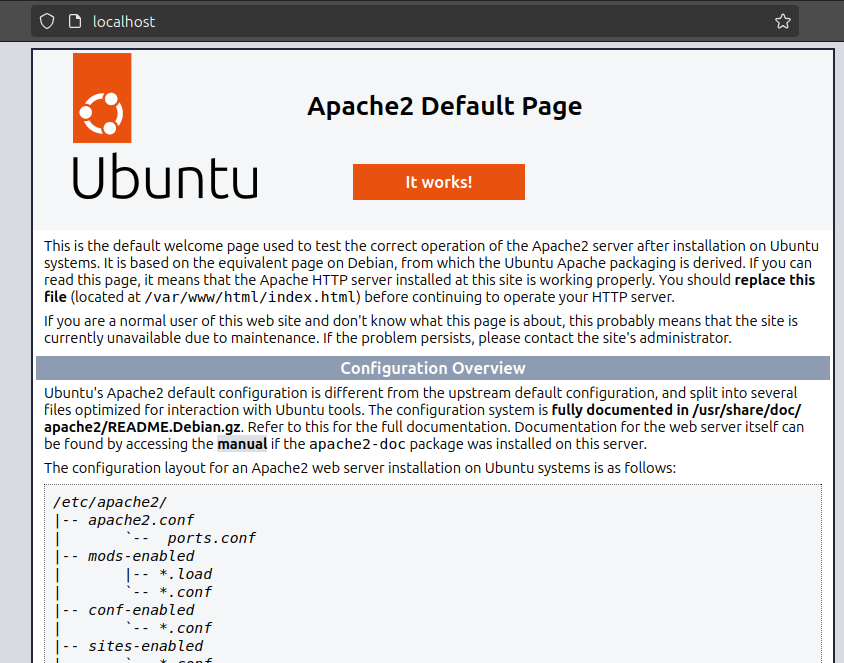
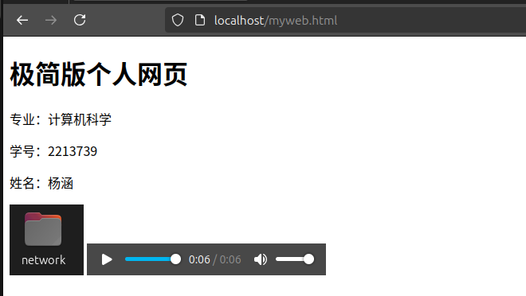
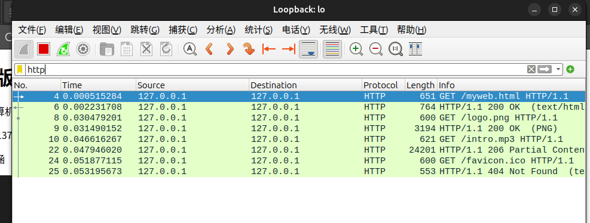
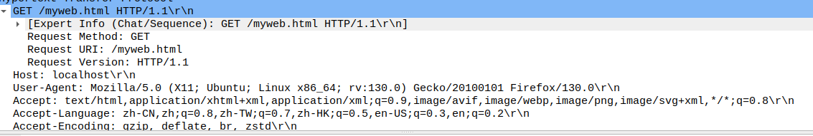
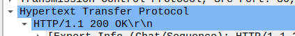
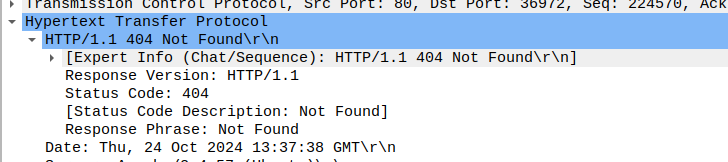
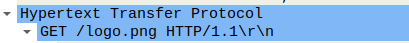

# Web服务器搭建实验报告

## 一、实验目的
通过本实验，掌握Web服务器的搭建与配置，了解HTTP协议的基本交互过程，以及使用Wireshark捕获网络数据包的基本操作。

## 二、实验环境
- **操作系统**：Vmware:Linux Ubuntu 22.04
- **Web服务器搭建软件**：Apache2
- **抓包软件**：Wireshark 4.0.8
- **浏览器**：Firefox

## 三、实验内容

### 1. Web服务器搭建
选择在Linux系统上搭建Apache Web服务器，具体步骤如下：

1. 更新软件包列表：
   ```bash
   sudo apt update
   ```

2. 安装Apache服务器：
   ```bash
   sudo apt install apache2
   ```

3. 启动Apache服务：
   ```bash
   sudo systemctl start apache2
   ```

4. 设置开机自启：
   ```bash
   sudo systemctl enable apache2
   ```

5. 验证服务器是否正常运行，在浏览器中访问 `http://localhost`，显示Apache默认页面。
{width="500"}
### 2. 简单Web页面制作
因为课程重心不在html文档的美观上（那应该是数据可视化的内容），这里只创建一个包含个人信息的简单HTML页面，文件内容如下：

```html                                               
<!DOCTYPE html>
<html lang="zh">
<head>
    <meta charset="UTF-8">
    <title>我的网页</title>
</head>
<body>
    <h1>极简版个人网页</h1>
    <p>专业：计算机科学</p>
    <p>学号：2213739</p>
    <p>姓名：杨涵</p>
    
    <audio controls>
        <source src="intro.mp3" type="audio/mpeg">
        缺省显示：您的浏览器不支持音频元素。
    </audio>
</body>
</html>

```

将该文件命名为 `myweb.html`，并将它和两个资源文件一起放置在Apache的根目录 `/var/www/html/` 下。

### 3. 访问Web页面
在浏览器中输入 `http://localhost/myweb.html`，查看制作的个人主页，发现可以正常显示。

### 4. Wireshark捕获HTTP交互过程
1. 打开Wireshark（root权限下），选择网络接口loopback：lo(回环接口，因为此处浏览器和服务器都是本地ip)进行捕获。
2. 设置过滤器为 `http`，以只显示HTTP协议的相关数据包。
3. 在浏览器中重新访问 `http://localhost/myweb.html`（ctrl f5刷新缓存），观察Wireshark中捕获到的HTTP请求与响应报文。

- 结果如图所示，一共有4对http报文，分别对应着html文档、logo.png、intro.mp3、ico（网页图标，即使文档中没有也会请求）的请求与响应。

- 多次实验后发现，多次请求和回复始终秉持一定的顺序，即发送get_a请求后必须收到response_a后才能继续发送get_b。事实证明pipeline在http1.1中虽然被支持，但实际因为准确性问题并没有被广泛采用。
- 课上学的不同http协议版本的区别主要在于对传输层的调用次数不同，如1.0非持续连接每次请求资源都要去新发起TCP连接、接收完立刻断开。
- 协议的版本影响传输效率，但这个区别并不影响http本身的数据包数量，如本实验中html文档资源+图片+音频共3个文件，理论上无论哪个版本的html协议都会有8个http数据包（请求/响应）。
## 四、HTTP交互过程说明

在浏览器与Web服务器之间的交互过程中，HTTP（超文本传输协议）负责数据的请求和响应。以下是HTTP交互过程的详细说明：

1. **客户端请求**：
   - 用户在浏览器中输入URL（例如`http://localhost/myweb.html`），浏览器构建一个HTTP GET请求，询问服务器提供所请求的资源。
   - 请求报文的基本结构如下：
     ```
     GET /myweb.html HTTP/1.1
     Host: localhost
     User-Agent: Mozilla/5.0 ...
     Accept: text/html,application/xhtml+xml,...
     ```
     抓包结果如下图所示，可以验证：
    
2. **服务器响应**：
   - 服务器接收到请求后，会处理该请求，查找所请求的资源（例如`myweb.html`），并返回HTTP响应。
   - 响应报文的基本结构如下：
     ```
     HTTP/1.1 200 OK
     Content-Type: text/html; charset=UTF-8
     Content-Length: [length]
     
     [HTML content]
     ```
    抓包结果如下图所示，可以验证：
    
3. **状态码**：
   - 服务器在响应中包含状态码，用于指示请求的处理结果。例如：
     - `200 OK`：请求成功，服务器返回所请求的资源。
     - `404 Not Found`：请求的资源不存在。
     - `500 Internal Server Error`：服务器遇到错误，无法完成请求。
    
    如图所示，由于我们没有在文件夹中放入ico文件，请求ico后会返回404 not found：
    
4. **资源加载**：
   - 如果响应成功，浏览器解析HTML内容，并根据其中的资源链接（如图片、音频等）发起额外的HTTP请求。
   - 每个附件都将遵循类似的请求和响应过程。例如，当浏览器解析到``时，会发送：
     ```
     GET /logo.png HTTP/1.1
     Host: localhost
     ```
    抓包结果如下图所示，可以验证：
    
5. **完成加载**：
   - 所有资源都成功加载后，浏览器将呈现完整的网页，用户可以与之交互。

6. **低层支持**：
   http作为顶层应用层的一种协议，需要各个低层的协议支持。比较重要的是TCP的建立连接和发送机制、断开过程。虽然本次实验只要求观察http的数据包，观察TCP包仍然可以验证http1.1的“持久连接”特性——建立连接后多个请求和接收都在同一个TCP连接上进行，而没有每次都断开。


通过这一过程，HTTP协议确保了客户端与服务器之间的高效数据传输和交互。

## 五、实验总结
通过本次实验，掌握了Web服务器的搭建与配置，熟悉了简单HTML页面的制作以及HTTP协议的交互过程。同时，了解了Wireshark的基本使用方法，为今后网络编程与调试打下了良好的基础。